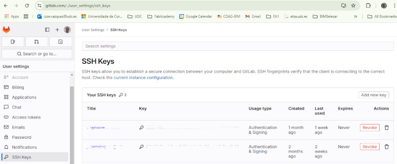

Link: [Student Agreement](../../docs/studentagreement)

This is my first week at FabAcademy
## Principles and practices. Project Management
Useful links and references used:
- [Git Simple Cheat Sheet](https://pub.fabcloud.io/tutorials/week01_principles_practices_project_management/git_simple.html)
- [Git Extended Cheat Sheet](https://pub.fabcloud.io/tutorials/week01_principles_practices_project_management/git_cheat_sheet.html-)

## GIT
Git is a version control system that allows us to manage and track the history of our source code.
#### Install and setup git step by step

Install [Git BASH](https://gitforwindows.org/) for windows users   
$ git config --global user.name "myname"  
$ git config --global user.email "myname@mail.org"  

**Check SHH KEY**  
Check if I have a SSH KEY already
$ cat ~/.shh/id_rsa.pub  
> cat: /c/Users/myname/.shh/id_rsa.pub: No such file or directory 

**Generate SSH KEY**  
ssh-keygen -t rsa -C myname@mail.org  
> Generating public/private rsa key pair.  
Enter file in which to save the key (/c/Users/myname/.ssh/id_rsa):  
Created directory '/c/Users/myname/.ssh'    
Enter passphrase for "/c/Users/myname/.ssh/id_rsa" (empty for no passphrase):  
Enter same passphrase again:  
Your identification has been saved in /c/Users/myname/.ssh/id_rsa  
Your public key has been saved in /c/Users/myname/.ssh/id_rsa.pub  
The key fingerprint is:   
The key's randomart image is:   
+---[xxx 1234]----+  
+----[xxx123]-----+

**Visualise SHH key**
$ cat ~/.ssh/id_rsa.pub

ssh-rsa
ABCDEFGHIJKLMNÑOPQRSTUVWXYZ*****

**Config** Set color in command line  
$ git config --global color.ui true  

**Visualize git configuration**  
$ cat .git/config  
[user]  
  *name = myname  
  email = myname@mail.org  
[color]  
  ui = true

**Setup local git project**  
$ mkdir myfolder  
$ cd myfolder

**Initializing git**  
Initialized empty Git repository in C:/Users/myname/myfolder  
$ git init

**Stablish a secure connection with GITHUB**   
Copy shh key to clipboard  
$ clip <~/.ssh/id_rsa.pub  
Add new key

**Create repository on github or gitlab**  
Copy link name from CODE and define origin od remote repository 
$ git remote add origin https://github.com/user/project.git  

**Create first local file readme.md and..**  
git add readme.md  
git commit -m "uploading my first file"  _No more than 50_ characters  
git push  

git clone https://github.com/user/project.git  
git clone https://gitlab.com/user/project.git 

View origin
$ git remote --v  
origin  https://github.com/pepe-vazquez/javazr.git (fetch)  
origin  https://github.com/pepe-vazquez/javazr.git (push)  

set origin
$ git remote set-url origin https://github.com/pepe-vazquez/javazr.git